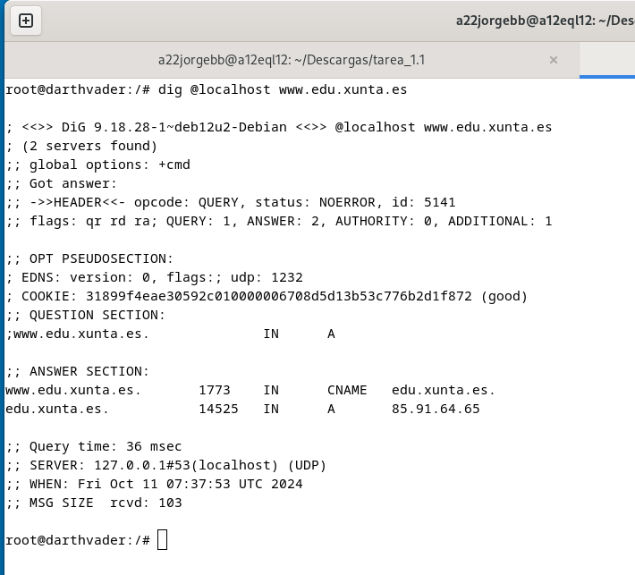

## Tarea 1.1 Instalación de zonas mestras primarias.

## [Enlace al repositorio](https://github.com/a22jorgebb/tarea_1.1)

Para llevar a cabo esta tarea hubo que añadir volúmenes para cada
archivo a configurar en el servidor DNS BIND9:


### 1 - Instala el servidor BIND9 en el equipo Darthvader. Comprueba que ya esté funcionando como servidor DNS caché.
Salida del comando `dig @localhost www.edu.xunta.es`:



### 2 - Configura el servidor BIND9 para utilizar 8.8.8.8 como **reenviador**.

Contenido del fichero **/etc/bind/named.conf.options**


Salida del comando ```dig @localhost www.mecd.gob.es```


### 3 - Instala una **zona primaria de resolución directa** llamada "starwars.lan", y añade los **registros de recursos** indicados (*además de los registros NS y SOA imprescindibles*)

Contenido del **archivo de zona**


Contenido del archivo **/etc/bind/named.conf.local**


### 4 -  Instalación de **zona inversa** que tenga que ver con la dirección del equipo darthvader y añade *registros PTR* para los registros tipo A del ejercicio anterior

Contenido del **archivo de zona**


Contenido del archivo **/etc/bind/named.conf.local**


### 5 - Comprueba que puedes resolver los distintos registros de recursos.

- `nslookup darthvader.starwars.lanlocalhost`
- `nslookup skywalker.starwars.lan localhost`
- `nslookup starwars.lan localhost`
- `nslookup -q=mx starwars.lan localhost`
- `nslookup -q=ns starwars.lan localhost`
- `nslookup -q=soa starwars.lan localhost`
- `nslookup -q=txt lenda.starwars.lan localhost`
- `nslookup 192.168.20.11 localhost`


## [Enlace al repositorio](https://github.com/a22jorgebb/tarea_1.1)